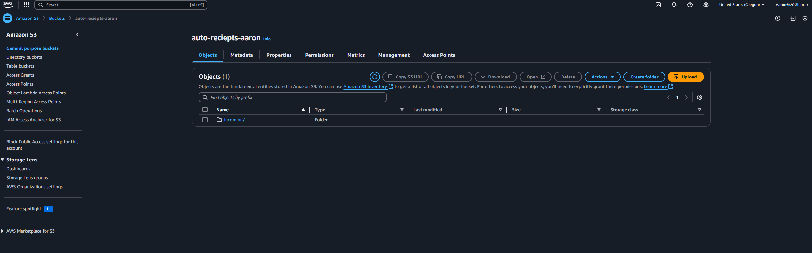
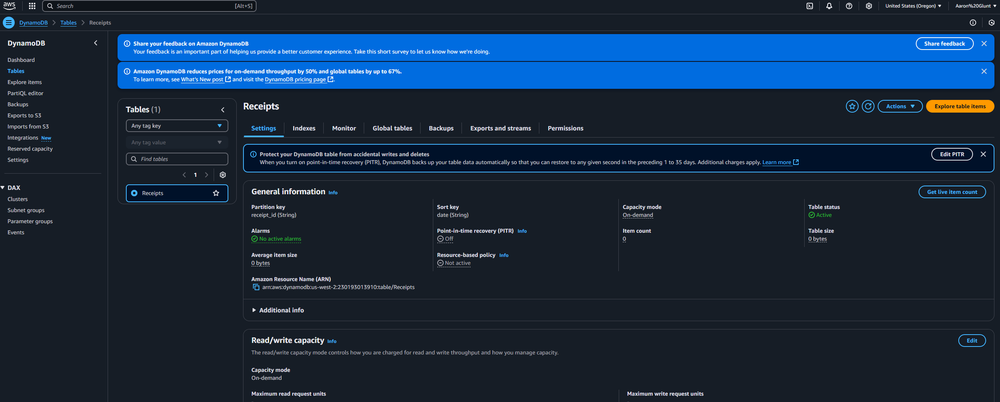
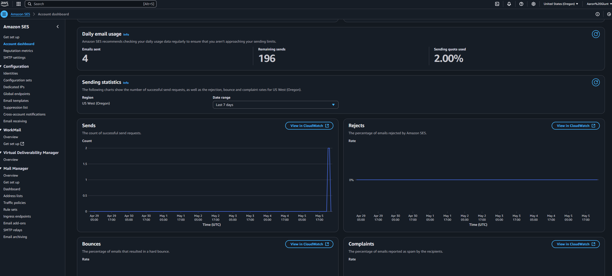
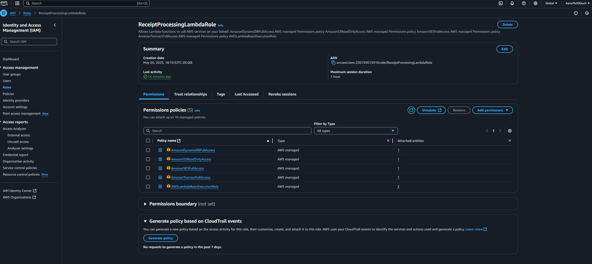
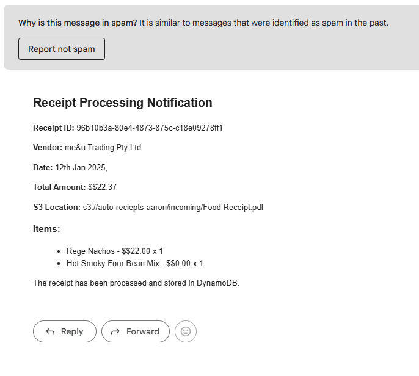

# cloudreceipts
CloudReceipts is an AI-powered receipt management system that automates expense tracking using AWS Lambda, S3, Textract, DynamoDB, and SES. When a receipt PDF is uploaded, it extracts key details, stores them in a structured database, and sends an email notification—eliminating manual data entry for seamless cloud-based organization.

## How It Works
1️⃣ User uploads a receipt (PDF) to an S3 bucket.  
2️⃣ AWS Textract extracts key details (date, amount, merchant).  
3️⃣ Data is stored in DynamoDB for tracking.  
4️⃣ An email notification is sent via AWS SES.

**Tech Stack:** AWS | Lambda | DynamoDB | Textract | S3 | Python  

# 📄 AWS Receipt Processing Pipeline  

An automated **receipt processing system** using **AWS Lambda, S3, Textract, DynamoDB, and SES**. When a receipt PDF is uploaded to an **S3 bucket**, the pipeline extracts relevant details, stores the data in **DynamoDB**, and sends an email notification via **AWS SES**.  

Here's a polished version for your GitHub README, structured for clarity and readability:

---

# AWS Receipt Processing Pipeline

## Overview
This project sets up an automated pipeline for processing receipts using AWS services. The system leverages Amazon S3 for storage, DynamoDB for metadata management, AWS Lambda for processing, Amazon SES for email notifications, and CloudWatch for monitoring.

## Steps Taken

### 1. **S3 Bucket Creation**
- Set up an S3 bucket to store uploaded receipts.

### 2. **DynamoDB Table Setup**
- Created a DynamoDB table to store receipt metadata.
- Defined a partition key and a sort key (string format) to organize the data.

### 3. **Email Identity with Amazon SES**
- Configured Amazon Simple Email Service (SES) and verified an email identity for notifications.

### 4. **IAM Role and Permissions**
Assigned the necessary AWS-managed policies to ensure proper access control:
- `AmazonDynamoDBFullAccess`
- `AmazonS3ReadOnlyAccess`
- `AmazonSESFullAccess`
- `AmazonTextractFullAccess`
- `AWSLambdaBasicExecutionRole`

### 5. **Lambda Function Creation**
- Developed an AWS Lambda function using Python 3.9 to process receipt data.
- Adjusted the timeout setting to **3 minutes** to handle longer receipt processing tasks.
- Added environment variables:
  - `DYNAMODB_TABLE`
  - `SES_SENDER_EMAIL`
  - `SES_RECIPIENT_EMAIL`

### 6. **Event Notification for Receipt Uploads**
- Configured event notifications to trigger upon receipt uploads.
- Designed the system to send an email alert when a new receipt is added.

### 7. **Testing and Debugging**
- Uploaded sample receipts and monitored performance via CloudWatch metrics.
- Initial issues:
  - Region mismatch errors—resolved by specifying the correct AWS region in the Lambda function.
  - Emails landing in the spam folder (😅)—confirmed email reception and adjusted accordingly.

## Results
The pipeline now successfully processes receipts, stores metadata in DynamoDB, and sends email notifications via SES. CloudWatch provides real-time monitoring, ensuring smooth operation.

### 📌 Credits  
This project was built following a tutorial by [TechWithLucy](https://youtube.com/TechWithLucy).

